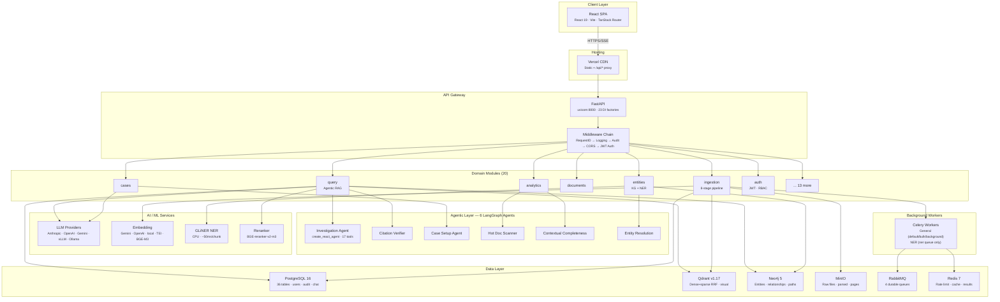
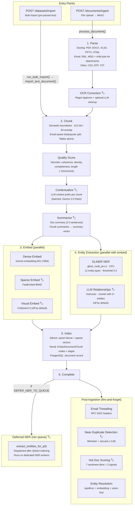
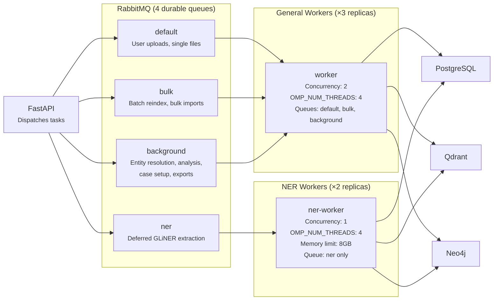
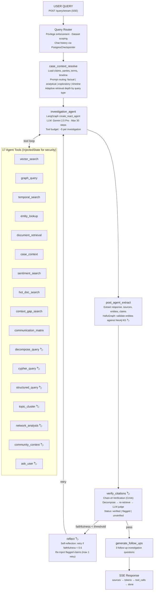
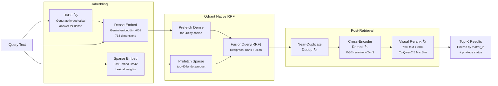
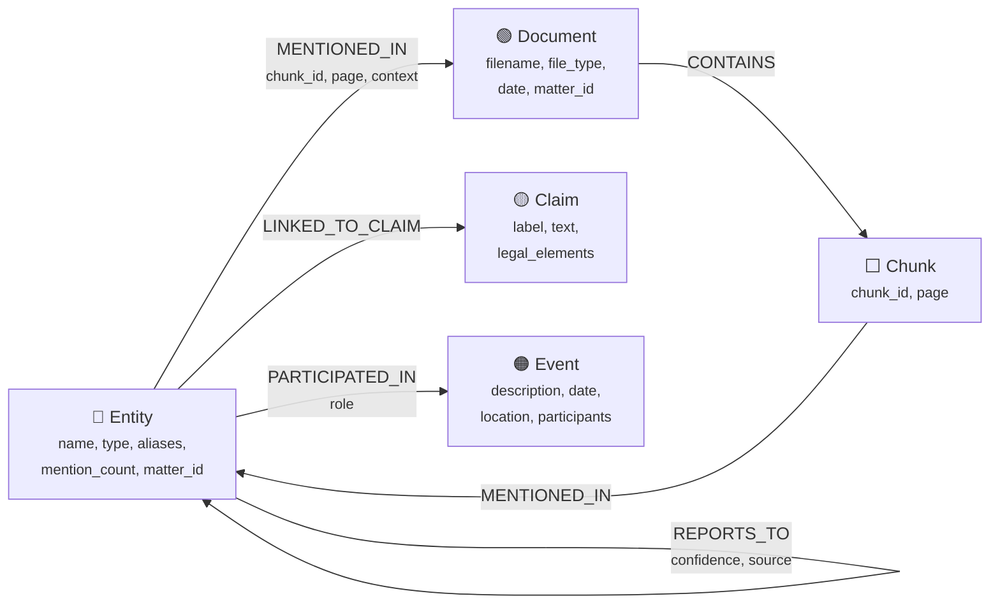
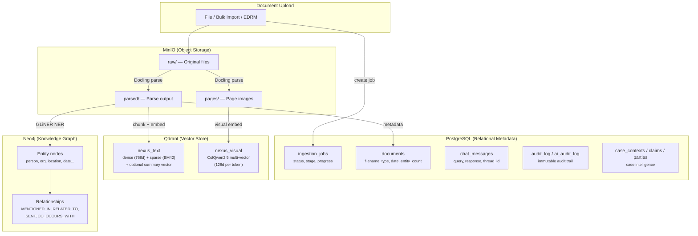

# NEXUS — System Architecture

> Multimodal RAG Investigation Platform for Legal Document Intelligence

**Last updated:** 2026-03-12 | **Status:** All milestones complete (M0–M21)

---

## Overview

NEXUS ingests, analyzes, and queries 50,000+ pages of mixed-format legal documents. It surfaces people, relationships, timelines, and patterns across a heterogeneous corpus with cited, auditable answers. Built for the eDiscovery / litigation support vertical where investigators and attorneys need to query massive document collections with full auditability and privilege enforcement.

6 autonomous LangGraph agents handle investigation, citation verification, case setup, hot document detection, contextual completeness analysis, and entity resolution. The platform runs fully local with zero cloud API dependency, or with cloud LLM/embedding providers.

---

## System Architecture



---

## Tech Stack

### Infrastructure

| Component | Technology | Notes |
|---|---|---|
| API | FastAPI 0.115+ | Async, OpenAPI docs, DI |
| Task Queue | Celery 5.5+ / RabbitMQ | Durable message broker; Redis fallback via `CELERY_BROKER_URL` |
| Object Storage | MinIO (S3-compat) | Bucket webhook triggers ingestion |
| Metadata DB | PostgreSQL 16 | Users, matters, jobs, documents, chat, audit, LangGraph checkpointer |
| Vector DB | Qdrant v1.17.1 | Named dense+sparse vectors, native RRF fusion |
| Knowledge Graph | Neo4j 5.x | Entity graph, multi-hop traversal, path-finding, temporal queries |
| Message Broker | RabbitMQ 3.x | Celery broker — durable queues, publisher confirms, dead-letter handling |
| Cache | Redis 7+ | Rate limiting, Celery result backend, response cache |

### AI Models

| Role | Implementation | Status |
|---|---|---|
| LLM (reasoning) | Claude Sonnet 4.5 (Anthropic), OpenAI, vLLM, Ollama | Active (4 providers) |
| Text Embeddings | OpenAI `text-embedding-3-large` (1024d), Ollama, local, TEI, Gemini | Active (5 providers) |
| Sparse Embeddings | FastEmbed `Qdrant/bm42-all-minilm-l6-v2-attentions` | Implemented (`ENABLE_SPARSE_EMBEDDINGS`) |
| Zero-shot NER | GLiNER (`gliner_multi_pii-v1`, CPU, ~50ms/chunk) | Active |
| Structured Extract | Instructor + Claude | Implemented (`ENABLE_RELATIONSHIP_EXTRACTION`) |
| Reranker | `bge-reranker-v2-m3` (MPS/CUDA/CPU) or TEI | Implemented (`ENABLE_RERANKER`) |
| Visual Embeddings | ColQwen2.5 (`vidore/colqwen2.5-v0.2`) | Implemented (`ENABLE_VISUAL_EMBEDDINGS`) |
| Topic Clustering | BERTopic + `all-MiniLM-L6-v2` | Implemented (`ENABLE_TOPIC_CLUSTERING`) |

### Document Processing

| File Types | Parser |
|---|---|
| PDF, DOCX, XLSX, PPTX, HTML, images | Docling 2.70+ |
| EML | Python `email` stdlib |
| MSG | `extract-msg` |
| RTF | `striprtf` |
| CSV, TXT | Python stdlib |
| ZIP | `zipfile` stdlib → route contents by extension |

### Orchestration

| Component | Technology |
|---|---|
| Query orchestration | LangGraph (agentic tool-use loop with PostgresCheckpointer) |
| Retrieval primitives | LlamaIndex (core only) |
| Structured output | Instructor 1.14+ |

### Frontend

| Component | Technology |
|---|---|
| Framework | React 19 + Vite |
| Language | TypeScript |
| Routing | TanStack Router (type-safe) |
| Server state | TanStack Query |
| Client state | Zustand |
| API codegen | orval (OpenAPI → TanStack Query hooks) |
| UI components | shadcn/ui |
| Testing | Vitest + React Testing Library + Playwright (E2E) |

---

## Ingestion Pipeline

8-stage Celery pipeline with retry, progress tracking, job cancellation, and child job dispatch.



> 🏷️ = Feature-flagged stage (see `/admin/feature-flags` or `docs/feature-flags.md`)

### Worker & Queue Architecture



> Separation prevents CPU-bound NER tasks from starving I/O-bound import tasks. See `docker-compose.ingest.yml` and `docs/CLOUD-DEPLOY.md` for tuning.

### Key Design Decisions

- **Docling over PyMuPDF**: Structural awareness (headings, tables, lists) enables semantic chunking. PyMuPDF gives flat text.
- **GLiNER over LLM NER**: Zero-shot at 50ms/chunk on CPU. LLM extraction reserved for relationship-rich chunks (feature-flagged).
- **Semantic chunking**: Respects paragraph/table boundaries. 512 tokens, 64 overlap, markdown table protection, email-aware body/quote splitting.
- **Chunk quality scoring**: Heuristic scoring (coherence, information density, completeness, length) — low-quality chunks can be skipped during contextualization and filtered at query time.
- **Contextual chunk enrichment** (feature-flagged): LLM generates a concise context sentence per chunk (Anthropic contextual retrieval pattern). Context prefix is prepended to chunk text before embedding, improving retrieval by disambiguating chunks from their broader document context. Original chunk text preserved for citations.
- **Dense + sparse embeddings**: Multi-provider dense vectors, FastEmbed BM42 for sparse. Both stored in Qdrant named vectors for native RRF fusion.
- **Multiple entry paths**: Direct upload, MinIO webhook, EDRM load file import (DAT/OPT/CSV), bulk import for pre-OCR'd datasets.

---

## Query Engine — Agentic Pipeline

**The core differentiator.** An autonomous tool-use agent loop backed by `create_react_agent`.

### State Graph



Controlled by `ENABLE_AGENTIC_PIPELINE` (default `true`). When disabled, falls back to the v1 10-node linear chain (classify → rewrite → retrieve → grade_retrieval → rerank → check_relevance → graph_lookup → synthesize → follow_ups).

### Nodes

1. **`case_context_resolve`** — Loads case context for the matter, builds term map for alias resolution, classifies query tier (`fast` / `standard` / `deep`), sets recursion limits
2. **`investigation_agent`** — `create_react_agent` subgraph with `ChatAnthropic` and 16 tools (+1 `ask_user` when clarification enabled). Autonomously selects tools, iterates, and produces a cited response
3. **`post_agent_extract`** — Extracts structured fields (source documents, entities) from the agent's response
4. **`verify_citations`** — Chain-of-Verification (CoVe): decomposes response into claims, independently retrieves evidence, judges each claim. Skipped for fast-tier
5. **`generate_follow_ups`** — Generates 3 follow-up investigation questions

### Tools (12)

| Tool | Description |
|---|---|
| `vector_search` | Semantic similarity search across document chunks |
| `graph_query` | Query Neo4j knowledge graph for entity relationships |
| `temporal_search` | Search documents within a date range |
| `entity_lookup` | Look up entity by name with alias resolution |
| `document_retrieval` | Retrieve all chunks for a specific document |
| `case_context` | Retrieve case-level context: claims, parties, terms, timeline |
| `sentiment_search` | Search by sentiment dimension score |
| `hot_doc_search` | Find hot documents ranked by composite risk score |
| `context_gap_search` | Find documents with missing context |
| `communication_matrix` | Analyze sender-recipient communication patterns |
| `topic_cluster` | Cluster retrieved documents by topic (BERTopic) |
| `network_analysis` | Compute entity centrality metrics |

All tools use `InjectedState` for security context — the LLM never sees `matter_id`, privilege filters, or dataset scoping.

### Classification-Driven Strategy

`case_context_resolve` classifies each query into a tier:

| Tier | Recursion Limit | Citation Verification | Use Case |
|---|---|---|---|
| fast | 16 | Skipped | Simple factual lookups |
| standard | 28 | Enabled | Multi-step reasoning |
| deep | 50 | Enabled | Complex investigation |

### Structured Output

```python
class CitedClaim(BaseModel):
    claim_text: str
    filename: str
    page_number: int | None
    excerpt: str
    grounding_score: float
    verification_status: Literal["verified", "flagged", "unverified"]
```

---

## Autonomous Agents

NEXUS uses 6 autonomous agents across the pipeline. See `docs/agents.md` for full state schemas, tools, and flows.

| # | Agent | Module | Trigger | Feature Flag |
|---|---|---|---|---|
| 1 | Investigation Orchestrator | `app/query/graph.py` | Every query | `ENABLE_AGENTIC_PIPELINE` (default `true`) |
| 2 | Citation Verifier | `app/query/nodes.py` | Post-agent (within orchestrator) | `ENABLE_CITATION_VERIFICATION` (default `true`) |
| 3 | Case Setup Agent | `app/cases/agent.py` | `POST /cases/{matter_id}/setup` | `ENABLE_CASE_SETUP_AGENT` |
| 4 | Hot Doc Scanner | `app/analysis/tasks.py` | Post-ingestion (Celery) | `ENABLE_HOT_DOC_DETECTION` |
| 5 | Contextual Completeness | `app/analysis/completeness.py` | Within Hot Doc Scanner | `ENABLE_HOT_DOC_DETECTION` |
| 6 | Entity Resolution Agent | `app/entities/resolution_agent.py` | Post-ingestion (Celery) | Always available |

---

## Retrieval Architecture



### 1. Dense + Sparse Hybrid (Qdrant Native RRF)

Qdrant `nexus_text` collection with named vectors:

```python
client.create_collection(
    collection_name="nexus_text",
    vectors_config={"dense": VectorParams(size=1024, distance=Distance.COSINE)},
    sparse_vectors_config={"sparse": SparseVectorParams()},
)
```

Query with native prefetch + RRF:

```python
results = client.query_points(
    collection_name="nexus_text",
    prefetch=[
        Prefetch(query=dense_vector, using="dense", limit=40),
        Prefetch(query=sparse_vector, using="sparse", limit=40),
    ],
    query=FusionQuery(fusion=Fusion.RRF),
    limit=15,
    query_filter=matter_and_privilege_filter,
)
```

### 2. CRAG-Style Retrieval Grading

`app/query/grader.py` — Two-tier relevance grading (behind `ENABLE_RETRIEVAL_GRADING`):
- **Tier 1 — Heuristic** (~10ms): keyword overlap + Qdrant semantic score blend
- **Tier 2 — LLM grading** (conditional): only when Tier 1 median < confidence threshold (default 0.5)
- Chunks below relevance threshold trigger query reformulation (max 1 retry)
- Uses the `query` LLM tier — set to Ollama in admin settings for zero-cost testing

### 3. Cross-Encoder Reranking

`app/query/reranker.py` with BGE-reranker-v2-m3 or TEI:
- Runs on Apple Silicon MPS (~50-100ms for 20 docs)
- Re-scores top-40 hybrid results → top-10
- `ENABLE_RERANKER` enabled by default
- TEI provider option for remote inference

### 4. Visual Reranking

`app/ingestion/visual_embedder.py` with ColQwen2.5:
- PDF pages rendered at configurable DPI, embedded with vision-language model
- Visual similarity scores blended with text scores
- Behind `ENABLE_VISUAL_EMBEDDINGS` feature flag

### 5. Query Expansion

For analytical/exploratory queries: generate 3 alternative formulations, retrieve independently, merge + dedup by chunk ID, then rerank the unified set.

### 6. Graph Retrieval

Neo4j traversals augment text retrieval:
- **Single-hop neighbors**: immediate entity connections
- **Multi-hop BFS**: `get_entity_neighborhood(name, hops=2)`
- **Path finding**: `find_path(entity_a, entity_b, max_hops=5)`
- **Temporal queries**: `get_temporal_connections(name, date_from, date_to)`
- **Co-occurrence**: `compute_co_occurrences(matter_id, min_count=3)`
- **Centrality**: degree, PageRank, betweenness (behind `ENABLE_GRAPH_CENTRALITY`)

---

## Knowledge Graph



### Node Types

| Label | Key Properties |
|---|---|
| `:Entity` | id, name, type, aliases, mention_count, matter_id |
| `:Document` | id, filename, file_type, date, matter_id |
| `:Event` | id, description, date, location, participants, matter_id |
| `:Claim` | id, label, text, legal_elements, matter_id (from Case Setup) |

### Edge Types

| Relationship | Between | Properties |
|---|---|---|
| `MENTIONED_IN` | Entity → Document | chunk_id, page, context |
| `RELATED_TO` | Entity → Entity | type, description, date_from, date_to, documents |
| `PARTICIPATED_IN` | Entity → Event | role |
| `CO_OCCURS_WITH` | Entity → Entity | frequency, documents |
| `ALIAS_OF` | Entity → Entity | (from resolution) |
| `REPORTS_TO` | Entity → Entity | confidence, source (from org hierarchy inference) |
| `LINKED_TO_CLAIM` | Entity → Claim | (from Case Setup) |

### Entity Resolution

- **Pairwise matching**: rapidfuzz (threshold 85) + embedding cosine (>0.92)
- **Transitive closure**: Union-find (disjoint set) — A≈B and B≈C correctly merges A↔B↔C
- **Canonical entity**: Each group merges into one node; aliases preserved
- **Org hierarchy inference**: Communication pattern analysis → `REPORTS_TO` edges
- **Case term linking**: Case-defined terms bridged to graph entities via `ALIAS_OF`

---

## Case Intelligence

The Case Setup Agent extracts structured intelligence from an anchor document (typically a complaint):

- **Claims** — numbered legal claims with elements and source page references
- **Parties** — plaintiffs, defendants, counsel, witnesses with roles and aliases
- **Defined Terms** — legal terms with definitions, linked to knowledge graph entities
- **Timeline** — chronological events with dates, descriptions, and participants

Results are persisted to PostgreSQL (`case_contexts`, `case_claims`, `case_parties`, `case_defined_terms`) and Neo4j (party Entity nodes, Claim nodes). The `CaseContextResolver` auto-injects this context into every query for the matter, improving retrieval relevance and enabling alias resolution.

---

## Analytics & Intelligence

### Sentiment Analysis + Hot Doc Detection

`SentimentScorer` scores documents across 7 dimensions (positive, negative, pressure, opportunity, rationalization, intent, concealment) plus 3 hot-doc signals. Documents exceeding the threshold are flagged as "hot docs." Behind `ENABLE_HOT_DOC_DETECTION`.

### Communication Analytics

`AnalyticsService` provides:
- **Communication matrices** — sender-recipient pair analysis with message counts and date ranges
- **Network centrality** — degree, PageRank, betweenness via Neo4j GDS (behind `ENABLE_GRAPH_CENTRALITY`)
- **Org hierarchy inference** — inferred `REPORTS_TO` relationships from email patterns
- **Topic clustering** — BERTopic clusters document chunks by theme (behind `ENABLE_TOPIC_CLUSTERING`)

### Contextual Completeness

`CompletenessAnalyzer` detects missing context: absent attachments, prior conversations, forward references, coded language, unusual terseness.

### Communication Anomaly Detection

`CommunicationBaseline` computes per-person statistical baselines and flags documents deviating significantly from the sender's typical patterns.

---

## Litigation Support

### Annotations

User notes, highlights, tags, and issue codes on documents. Stored in PostgreSQL `annotations` table, scoped by matter and user.

### Export Pipeline

- **Production sets** — named document collections with Bates numbering
- **Export formats** — ZIP packages with HTML/PDF/JSON + load files
- **Bates stamping** — configurable prefix, padding, and sequence numbering

### Redaction

- **PII detection** — GLiNER-based detection of SSN, phone, email, address
- **Manual + automatic** — user-initiated and PII-detected redactions
- **Permanent redaction** — applied to PDF rendering, with audit trail
- Behind `ENABLE_REDACTION`

### EDRM Interop

- **Load file import** — DAT, OPT, CSV formats with field mapping
- **XML/DAT export** — EDRM-compatible production output
- **Email threading** — RFC 2822 header-based thread reconstruction

---

## Security Model

### Authentication (`app/auth/` module)

- JWT access tokens (30-min expiry) with `user_id`, `role`, `matter_ids`
- Refresh tokens (7-day, stored hashed in PostgreSQL)
- `python-jose` for JWT, `passlib` + bcrypt for passwords
- API key alternative for programmatic access

### RBAC (4 roles)

| Role | Ingest | Query | View Privileged | Tag Privilege | Manage Users | Audit Log |
|---|---|---|---|---|---|---|
| admin | Yes | Yes | Yes | Yes | Yes | Yes |
| attorney | Yes | Yes | Yes | Yes | No | Own |
| paralegal | Yes | Yes | No | No | No | Own |
| reviewer | No | Yes | No | No | No | No |

### Multi-Tenancy (Case Matters)

- `case_matters` table, `user_case_matters` join table
- `matter_id` FK on jobs, documents, chat_messages
- `X-Matter-ID` header required on all data endpoints
- Qdrant payloads include `matter_id`; queries filter on it
- Neo4j Document and Entity nodes get `matter_id` property

### Privilege Enforcement

- `privilege_status` column on documents: `not_reviewed` | `privileged` | `work_product` | `confidential` | `not_privileged`
- Enforced at the **data layer**: Qdrant filter, SQL WHERE, Neo4j Cypher
- Non-attorney users never see privileged docs — even if frontend filtering fails

### Audit Logging

- API middleware intercepts every call → `audit_log` table
- AI audit logging: every LLM call → `ai_audit_log` table (prompt hash, tokens, latency)
- Agent audit logging: tool calls and iteration steps → `agent_audit_log` table
- All three audit tables are immutable (PostgreSQL RULEs prevent UPDATE/DELETE)
- `GET /admin/audit-log` endpoint (admin-only, filterable)

---

## Data Model



> **Common key**: `doc_id` (UUID) links records across all 4 stores. `matter_id` scopes every query.

### PostgreSQL (36 tables, 24 migrations)

```mermaid
erDiagram
    %% ── Core ──
    jobs {
        uuid id PK
        varchar filename
        varchar status "pending|processing|complete|failed"
        varchar stage "uploading → complete"
        jsonb progress
        text error
        uuid parent_job_id FK "child jobs (ZIP)"
        uuid matter_id FK
        uuid dataset_id FK
        varchar error_category
        int retry_count
        varchar worker_hostname
        timestamptz started_at
        timestamptz completed_at
        timestamptz created_at
        timestamptz updated_at
    }

    documents {
        uuid id PK
        uuid job_id FK
        uuid matter_id FK
        varchar filename
        varchar document_type
        int page_count
        int chunk_count
        int entity_count
        varchar minio_path
        bigint file_size_bytes
        varchar content_hash "SHA-256 dedup"
        varchar privilege_status "not_reviewed|privileged|work_product|not_privileged"
        varchar message_id "RFC 2822"
        varchar thread_id
        int thread_position
        boolean is_inclusive
        varchar duplicate_cluster_id
        float hot_doc_score
        float anomaly_score
        float context_gap_score
        varchar import_source
        jsonb metadata_
        timestamptz created_at
    }

    chat_messages {
        uuid id PK
        uuid thread_id "conversation grouping"
        uuid matter_id FK
        varchar role "user|assistant|system"
        text content
        jsonb source_documents
        jsonb entities_mentioned
        jsonb follow_up_questions
        jsonb cited_claims
        timestamptz created_at
    }

    %% ── Auth ──
    users {
        uuid id PK
        varchar email UK
        varchar password_hash "bcrypt"
        varchar full_name
        varchar role "admin|attorney|paralegal|reviewer"
        varchar api_key_hash
        varchar sso_provider
        varchar sso_subject_id
        boolean is_active
        timestamptz created_at
    }

    case_matters {
        uuid id PK
        varchar name
        text description
        boolean is_active
        boolean is_archived "retention"
        timestamptz created_at
    }

    user_case_matters {
        uuid user_id PK,FK
        uuid matter_id PK,FK
        timestamptz assigned_at
    }

    %% ── Audit (all immutable — PG RULEs block UPDATE/DELETE) ──
    audit_log {
        uuid id PK
        uuid user_id FK
        varchar action "HTTP method"
        varchar resource "request path"
        varchar resource_type
        uuid matter_id
        varchar ip_address
        int status_code
        float duration_ms
        varchar request_id
        uuid session_id
        timestamptz created_at
    }

    ai_audit_log {
        uuid id PK
        uuid user_id FK
        uuid session_id
        varchar call_type "completion|embedding|extraction"
        varchar node_name "LangGraph node"
        varchar provider
        varchar model
        varchar prompt_hash "SHA-256, no content"
        int input_tokens
        int output_tokens
        float latency_ms
        varchar status
        timestamptz created_at
    }

    agent_audit_log {
        uuid id PK
        uuid user_id FK
        uuid session_id
        varchar agent_id
        varchar action_type "tool_call|plan|assess"
        varchar action_name
        int iteration_number
        float duration_ms
        timestamptz created_at
    }

    %% ── Cases ──
    case_contexts {
        uuid id PK
        uuid matter_id UK
        varchar anchor_document_id
        varchar status "processing|ready|confirmed"
        json timeline
        timestamptz created_at
    }

    case_claims {
        uuid id PK
        uuid case_context_id FK
        int claim_number
        varchar claim_label
        text claim_text
        json legal_elements
        json source_pages
    }

    case_parties {
        uuid id PK
        uuid case_context_id FK
        varchar name
        varchar role "plaintiff|defendant|witness"
        json aliases
        varchar entity_id "KG link"
    }

    case_defined_terms {
        uuid id PK
        uuid case_context_id FK
        varchar term
        text definition
        varchar entity_id "KG link"
    }

    investigation_sessions {
        uuid id PK
        uuid matter_id
        uuid case_context_id FK
        uuid user_id
        varchar title
        json findings
        varchar status
    }

    %% ── Datasets ──
    datasets {
        uuid id PK
        uuid matter_id FK
        uuid parent_id FK "tree structure"
        varchar name
        varchar dataset_type "folder|smart"
        jsonb filter_criteria
        int document_count
    }

    dataset_documents {
        uuid dataset_id PK,FK
        uuid document_id PK,FK
    }

    document_tags {
        uuid id PK
        uuid document_id FK
        uuid matter_id
        varchar tag_name
        varchar tag_value
    }

    dataset_access {
        uuid dataset_id PK,FK
        uuid user_id PK,FK
        varchar permission "read|write|admin"
    }

    %% ── Analytics ──
    communication_pairs {
        uuid id PK
        uuid matter_id
        varchar sender_name
        varchar recipient_name
        varchar relationship_type "to|cc|bcc"
        int message_count
        timestamptz first_date
        timestamptz last_date
    }

    org_chart_entries {
        uuid id PK
        uuid matter_id
        varchar person_name
        varchar reports_to
        float confidence
        varchar source
    }

    %% ── Annotations & Export ──
    annotations {
        uuid id PK
        uuid document_id FK
        uuid matter_id
        uuid user_id FK
        varchar annotation_type "note|highlight|tag|issue_code"
        text content
        jsonb position
    }

    production_sets {
        uuid id PK
        uuid matter_id
        varchar name
        varchar bates_prefix
        int bates_start
    }

    production_set_documents {
        uuid production_set_id PK,FK
        uuid document_id PK,FK
        varchar bates_number
    }

    export_jobs {
        uuid id PK
        uuid production_set_id FK
        varchar format "zip|pdf|json"
        varchar status
        varchar output_path
    }

    %% ── Other ──
    redactions {
        uuid id PK
        uuid document_id FK
        uuid user_id FK
        int page_number
        jsonb coordinates
        varchar reason
    }

    edrm_import_log {
        uuid id PK
        uuid matter_id
        varchar filename
        varchar format "dat|opt|csv"
        int record_count
        varchar status
    }

    bulk_import_jobs {
        uuid id PK
        uuid matter_id
        varchar adapter_type
        varchar source_path
        varchar status
        int total_documents
        int processed_documents
        int failed_documents
        int skipped_documents
    }

    evaluation_dataset_items {
        uuid id PK
        uuid matter_id
        text question
        text expected_answer
        jsonb expected_doc_ids
    }

    evaluation_runs {
        uuid id PK
        uuid dataset_item_id FK
        varchar run_label
        float retrieval_mrr
        float faithfulness
        float citation_accuracy
    }

    google_drive_connections {
        uuid id PK
        uuid user_id FK
        uuid matter_id
        text encrypted_token
        varchar folder_id
    }

    google_drive_sync_state {
        uuid id PK
        uuid connection_id FK
        varchar page_token
        timestamptz last_sync
    }

    memos {
        uuid id PK
        uuid matter_id
        uuid user_id FK
        varchar title
        text content
        varchar status "draft|final"
    }

    llm_providers {
        uuid id PK
        varchar name UK
        varchar provider_type
        varchar base_url
        varchar default_model
        boolean is_active
    }

    llm_tier_config {
        uuid id PK
        varchar tier UK "query|analysis|ingestion|general"
        uuid provider_id FK
        varchar model
    }

    feature_flag_overrides {
        uuid id PK
        varchar flag_name UK
        boolean enabled
        uuid changed_by FK
        timestamptz changed_at
    }

    retention_policies {
        uuid id PK
        uuid matter_id FK,UK
        int retention_days
        varchar action "archive|purge"
        timestamptz expires_at
    }

    %% ── Relationships ──
    jobs ||--o{ documents : "job_id"
    jobs }o--|| case_matters : "matter_id"
    jobs }o--o| datasets : "dataset_id"
    jobs }o--o| jobs : "parent_job_id"
    documents }o--|| case_matters : "matter_id"
    chat_messages }o--|| case_matters : "matter_id"
    users ||--o{ user_case_matters : "user_id"
    case_matters ||--o{ user_case_matters : "matter_id"
    case_matters ||--o| case_contexts : "matter_id"
    case_contexts ||--o{ case_claims : "case_context_id"
    case_contexts ||--o{ case_parties : "case_context_id"
    case_contexts ||--o{ case_defined_terms : "case_context_id"
    case_contexts ||--o{ investigation_sessions : "case_context_id"
    datasets ||--o{ dataset_documents : "dataset_id"
    documents ||--o{ dataset_documents : "document_id"
    datasets }o--o| datasets : "parent_id"
    documents ||--o{ annotations : "document_id"
    production_sets ||--o{ production_set_documents : "production_set_id"
    documents ||--o{ production_set_documents : "document_id"
    production_sets ||--o{ export_jobs : "production_set_id"
    documents ||--o{ redactions : "document_id"
    evaluation_dataset_items ||--o{ evaluation_runs : "dataset_item_id"
    google_drive_connections ||--o{ google_drive_sync_state : "connection_id"
    llm_providers ||--o{ llm_tier_config : "provider_id"
    case_matters ||--o| retention_policies : "matter_id"
```



See `docs/database-schema.md` for full column reference, indexes, and constraints.

### Qdrant Collections

| Collection | Vectors | Purpose |
|---|---|---|
| `nexus_text` | dense (1024d, cosine) + sparse (BM42) | Text chunk retrieval with native RRF |
| `nexus_visual` | multi-vector (128d, binary quantized) | Page-image retrieval (behind `ENABLE_VISUAL_EMBEDDINGS`) |

Payloads include: `document_id`, `matter_id`, `privilege_status`, `file_type`, `date`, `page_number`, `chunk_text`, `hot_doc_score`, `anomaly_score`, `quality_score`, `context_prefix`

### Neo4j Graph

Entity, Document, Event, and Claim nodes with relationships as described in the Knowledge Graph section. Constraints and indexes managed by `app/entities/schema.py` at startup.

### MinIO Buckets

| Prefix | Content |
|---|---|
| `documents/raw/` | Original uploaded files |
| `documents/parsed/` | Docling/stdlib parse output |
| `documents/pages/` | Page images for visual embeddings |

---

## API Endpoints

15 routers registered in `app/main.py`. See `docs/modules.md` for full endpoint reference.

```
# Authentication
POST   /api/v1/auth/login               # JWT token issuance
POST   /api/v1/auth/refresh             # Token refresh
GET    /api/v1/auth/me                  # Current user profile

# Ingestion
POST   /api/v1/ingest                   # Single file upload
POST   /api/v1/ingest/batch             # Multi-file upload (accepts ZIP)
POST   /api/v1/ingest/webhook           # MinIO bucket notification handler
GET    /api/v1/jobs/{job_id}            # Job status + progress
GET    /api/v1/jobs                     # List all jobs (paginated)

# Query & Chat
POST   /api/v1/query                    # Synchronous query (full response)
POST   /api/v1/query/stream             # SSE streaming query
GET    /api/v1/chats                    # List chat threads
GET    /api/v1/chats/{thread_id}        # Full chat history
DELETE /api/v1/chats/{thread_id}        # Delete chat thread

# Documents
GET    /api/v1/documents                # List documents (filterable)
GET    /api/v1/documents/{id}           # Document metadata + chunks
GET    /api/v1/documents/{id}/preview   # Page thumbnail (presigned URL)
GET    /api/v1/documents/{id}/download  # Original file (presigned URL)
PATCH  /api/v1/documents/{id}/privilege # Privilege tagging

# Knowledge Graph
GET    /api/v1/entities                 # Search/list entities
GET    /api/v1/entities/{id}            # Entity details + connections
GET    /api/v1/entities/{id}/connections # Graph neighborhood
GET    /api/v1/graph/explore            # Graph exploration (Cypher)
GET    /api/v1/graph/stats              # Graph statistics

# Cases
POST   /api/v1/cases/{matter_id}/setup  # Trigger Case Setup Agent
GET    /api/v1/cases/{matter_id}/context # Get case context
PUT    /api/v1/cases/{matter_id}/context/confirm # Confirm case context

# Analytics
GET    /api/v1/analytics/communication-matrix # Sender-recipient analysis
GET    /api/v1/analytics/network-centrality   # Entity centrality metrics
GET    /api/v1/analytics/org-hierarchy        # Inferred org chart

# Annotations
POST   /api/v1/annotations              # Create annotation
GET    /api/v1/annotations              # List annotations (filterable)
PATCH  /api/v1/annotations/{id}         # Update annotation
DELETE /api/v1/annotations/{id}         # Delete annotation

# Exports
POST   /api/v1/exports/production-sets  # Create production set
POST   /api/v1/exports/production-sets/{id}/documents # Add documents
POST   /api/v1/exports/production-sets/{id}/export    # Trigger export

# EDRM
POST   /api/v1/edrm/import              # Import EDRM load file

# Redaction
POST   /api/v1/redaction/detect          # Detect PII in document
POST   /api/v1/redaction/apply           # Apply redactions to PDF

# Datasets
GET    /api/v1/datasets                  # List datasets (folder tree)
POST   /api/v1/datasets                  # Create dataset
POST   /api/v1/datasets/{id}/documents   # Add documents to dataset

# Evaluation
GET    /api/v1/evaluation/datasets       # List evaluation datasets
POST   /api/v1/evaluation/runs           # Trigger evaluation run

# Admin
GET    /api/v1/admin/audit-log           # Filterable audit log (admin-only)
GET    /api/v1/admin/users               # User management (admin-only)
POST   /api/v1/admin/users               # Create user (admin-only)

# System
GET    /api/v1/health                    # Health check (all services)
GET    /api/v1/health/deep               # Deep health check (LLM + embedding)
```

---

## Key Patterns

- **LLM abstraction** (`app/common/llm.py`): Unified client for Anthropic/OpenAI/vLLM/Ollama. Cloud→local migration = change `LLM_PROVIDER` + base URL in `.env`
- **Multi-provider embeddings** (`app/common/embedder.py`): `EmbeddingProvider` protocol with 5 implementations (OpenAI, Ollama, local, TEI, Gemini). Switch via `EMBEDDING_PROVIDER`
- **DI singletons** (`app/dependencies.py`): All clients via `@functools.cache` factory functions (23 factories, see `_ALL_CACHED_FACTORIES`)
- **Hybrid retrieval** (`app/query/retriever.py`): Qdrant dense+sparse with native RRF fusion + Neo4j multi-hop graph traversal + optional visual rerank
- **Agentic query** (`app/query/graph.py`): `create_react_agent` with 16 tools (+1 `ask_user` when clarification enabled) → `case_context_resolve` → `investigation_agent` → `verify_citations` → `generate_follow_ups`
- **Agentic tools** (`app/query/tools.py`): 17 `@tool` functions with `InjectedState` for security-scoped matter_id and privilege filters
- **Case context** (`app/cases/`): Case Setup Agent extracts claims/parties/timeline from anchor doc, auto-injected into query graph via `context_resolver.py`
- **SSE streaming** (`app/query/router.py`): Sources sent before generation starts, then token-by-token LLM streaming via `graph.astream` + `get_stream_writer`
- **Auth + RBAC** (`app/auth/`): JWT access/refresh tokens, 4 roles, matter-scoped queries, privilege enforcement at data layer
- **Audit logging** (`app/common/middleware.py`): Every API call → `audit_log` table (user, action, resource, matter, IP)
- **AI audit logging** (`app/common/llm.py`): Every LLM call logged with prompt hash, tokens, latency → `ai_audit_log` table
- **Structured logging**: `structlog` with contextvars (`request_id`, `task_id`, `job_id`)
- **Feature flags**: 25 `ENABLE_*` flags, 23 runtime-toggleable via admin UI (see `docs/feature-flags.md` for full reference)
- **Privilege at data layer**: Qdrant filter + SQL WHERE + Neo4j Cypher — never API-layer-only
- **Frontend** (`frontend/`): React 19 + TanStack Router + orval (OpenAPI → TanStack Query hooks) + shadcn/ui + Zustand
- **Evaluation** (`app/evaluation/`, `scripts/evaluate.py`): Ground-truth Q&A dataset, retrieval metrics, faithfulness scoring, citation accuracy

---

## Decisions Log

### Keep (validated by implementation)
- **Docling** for parsing — structural awareness > flat text extraction
- **GLiNER** for NER — fast, CPU, zero-shot, right for ingestion-time
- **Celery** for ingestion — mature 6-stage pipeline with retry, don't rewrite
- **LangGraph** for orchestration — right abstraction (topology redesigned to agentic loop)
- **Neo4j** for graph — multi-hop/path-finding requires a real graph DB, not PG relations
- **Qdrant** for vectors — native RRF, multi-vector, metadata filtering > pgvector
- **Raw SQL** over ORM — known queries, performance matters
- **BERTopic** for topic clustering — CPU-friendly, no fine-tuning needed
- **`create_react_agent`** for investigation — prebuilt tool-use loop, right for autonomous investigation
- **InjectedState** for security context — agent tools receive filters without LLM exposure
- **CoVe** for citation verification — independent retrieval catches hallucinated citations
- **orval** for API codegen — generates type-safe TanStack Query hooks from OpenAPI spec
- **TanStack Router** for frontend routing — type-safe, file-based

### Changed (from prior implementation)
- Qdrant collection → named dense + sparse vectors with native RRF
- Query pipeline → agentic tool-use loop via `create_react_agent` (was classify → execute → assess → synthesize)
- Synthesis output → structured `CitedClaim` objects with verification status
- CORS → restricted origins (was `allow_origins=["*"]`)
- Entity resolution → transitive closure via union-find + org hierarchy inference (was pairwise only)
- Graph traversal → multi-hop, temporal, path-finding, centrality (was single-hop only)

### Added (not in prior implementation)
- `app/auth/` module (JWT, RBAC, API keys, matter scoping)
- `app/query/reranker.py` (cross-encoder BGE-reranker-v2-m3 + TEI)
- Sparse embedding in ingestion pipeline (FastEmbed BM42)
- Audit logging middleware (API + AI + agent)
- `app/evaluation/` (ground-truth datasets, retrieval metrics, regression tests)
- React frontend (replaces Streamlit prototype)
- Case intelligence (`app/cases/`) with Case Setup Agent
- Communication analytics (`app/analytics/`)
- Sentiment analysis + hot doc detection (`app/analysis/`)
- Export pipeline (`app/exports/`) with production sets and Bates numbering
- Redaction engine (`app/redaction/`) with PII detection
- EDRM interop (`app/edrm/`) with load file import/export
- Dataset/collection management (`app/datasets/`)
- Entity Resolution Agent (`app/entities/resolution_agent.py`)

### Avoided (explicitly rejected)
- **Don't remove Neo4j** — multi-hop traversal requires a graph DB
- **Don't use LangChain** — LangGraph + Instructor + direct clients is correct
- **Don't use pgvector** — Qdrant handles multi-vector and native fusion
- **Don't use Marker** — GPL-3.0 license
- **Don't use Redux** — Zustand for client state (simpler, less boilerplate)
- **Don't use Next.js** — Vite SPA is sufficient; no SSR needed
- **Don't over-engineer agentic loop** — configurable recursion limits, converge quickly
- **Don't implement full GraphRAG community summarization** — multi-hop traversal gives 90% of value

---

## Configuration

All configuration via environment variables. See `.env.example` for the complete list.

### Feature Flags (25)

| Flag | Default | Description |
|---|---|---|
| `ENABLE_AGENTIC_PIPELINE` | `true` | Agentic LangGraph query pipeline (vs. v1 linear chain) |
| `ENABLE_CITATION_VERIFICATION` | `true` | CoVe citation verification in query synthesis |
| `ENABLE_EMAIL_THREADING` | `true` | Email conversation thread reconstruction |
| `ENABLE_AI_AUDIT_LOGGING` | `true` | Log LLM calls to ai_audit_log table |
| `ENABLE_SPARSE_EMBEDDINGS` | `false` | BM42 sparse vectors for hybrid retrieval |
| `ENABLE_RERANKER` | `true` | Cross-encoder reranking of retrieval results |
| `ENABLE_VISUAL_EMBEDDINGS` | `false` | ColQwen2.5 visual embedding and reranking |
| `ENABLE_RELATIONSHIP_EXTRACTION` | `false` | LLM-based relationship extraction |
| `ENABLE_NEAR_DUPLICATE_DETECTION` | `false` | MinHash near-duplicate and version detection |
| `ENABLE_HOT_DOC_DETECTION` | `false` | Sentiment scoring and hot doc flagging |
| `ENABLE_TOPIC_CLUSTERING` | `false` | BERTopic topic clustering |
| `ENABLE_CASE_SETUP_AGENT` | `false` | Case context pre-population |
| `ENABLE_COREFERENCE_RESOLUTION` | `false` | spaCy + coreferee pronoun resolution |
| `ENABLE_GRAPH_CENTRALITY` | `false` | Neo4j GDS centrality metrics |
| `ENABLE_BATCH_EMBEDDINGS` | `false` | Async batch embedding API (stub) |
| `ENABLE_REDACTION` | `false` | PII detection and document redaction |
| `ENABLE_CHUNK_QUALITY_SCORING` | `false` | Heuristic chunk quality scoring at ingestion |
| `ENABLE_CONTEXTUAL_CHUNKS` | `false` | LLM context prefix enrichment at ingestion |
| `ENABLE_RETRIEVAL_GRADING` | `false` | CRAG-style two-tier retrieval relevance grading |
| `ENABLE_SSO` | `false` | OIDC single sign-on authentication |
| `ENABLE_SAML` | `false` | SAML 2.0 SSO authentication |
| `ENABLE_GOOGLE_DRIVE` | `false` | Google Drive OAuth connector |
| `ENABLE_PROMETHEUS_METRICS` | `false` | Prometheus metrics endpoint |
| `ENABLE_MEMO_DRAFTING` | `false` | Legal memo drafting pipeline |
| `ENABLE_DATA_RETENTION` | `false` | Data retention policy enforcement |

See `docs/feature-flags.md` for full details including resource impact and related settings.

---

## Development

```bash
# Start infrastructure
docker compose up -d

# Install Python deps
uv venv && source .venv/bin/activate
uv pip install -e ".[dev]"

# Run migrations
alembic upgrade head

# Start API (terminal 1)
uvicorn app.main:app --reload --port 8000

# Start Celery worker (terminal 2)
celery -A workers.celery_app worker -l info

# Start frontend (terminal 3)
cd frontend && npm install && npm run dev

# Run tests
pytest tests/ -v --cov=app

# Or use Makefile
make dev    # starts everything in one terminal
make test   # run test suite
```

---

## See Also

### Architecture & Planning
- `CLAUDE.md` — Implementation rules, project structure, do/don't guidelines
- `ROADMAP.md` — Milestone tracker with status and dependencies

### Reference Documentation (in `docs/`)
- `docs/modules.md` — All 19 domain modules with files, schemas, endpoints, and full API reference
- `docs/database-schema.md` — 36 tables, 24 migrations, full column reference
- `docs/feature-flags.md` — All 25 `ENABLE_*` flags with defaults and resource impact
- `docs/testing-guide.md` — Test infrastructure, fixtures, CI/CD, patterns
- `docs/agents.md` — 6 LangGraph agents with state schemas, tools, flows

### Configuration & Deployment
- `.env.example` — All configuration variables and feature flags
- `docker-compose.yml` — Infrastructure services (dev)
- `docker-compose.prod.yml` — Full containerized stack (API + worker + Flower)
- `docker-compose.cloud.yml` — Cloud overlay (Caddy reverse proxy + TLS)
- `docker-compose.local.yml` — Local LLM stack (vLLM/Ollama, TEI)
- `docs/CLOUD-DEPLOY.md` — GCP + Vercel deployment guide
- `docs/epstein-ingestion.md` — Dataset ingestion guide

### Historical Reference
- `docs/M13-FRONTEND-SPEC.md` — React frontend specification
- `docs/M6-BULK-IMPORT.md` — Bulk import spec for pre-OCR'd datasets
- `docs/QA-AUDIT-FINDINGS.md` — QA audit findings
- `docs/NEXUS-Features-Overview.md` — Features overview
